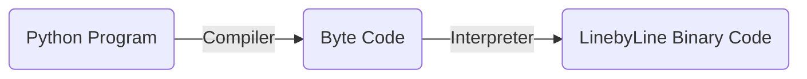
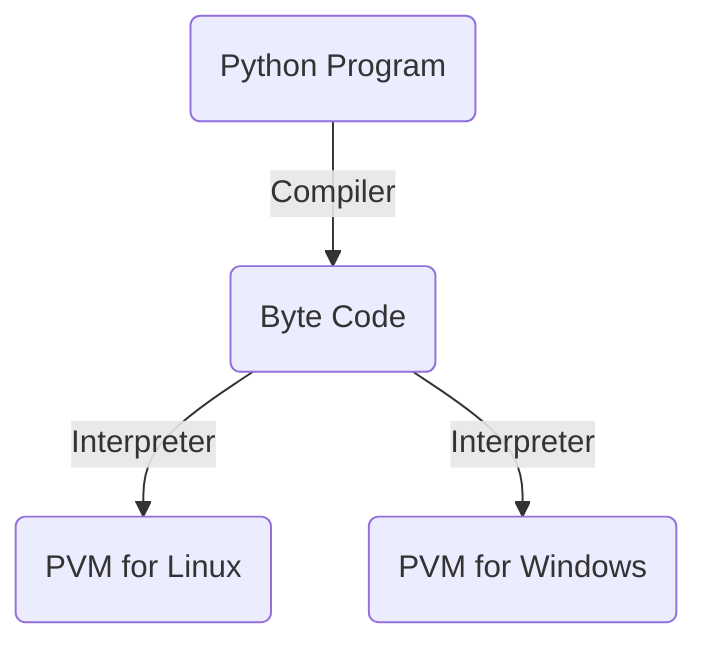

# PYTHON INTRODUCTION
  - ### Very Simple Syntax
  - ### Easy to understand

## General Purpose Language:
- Console  Applications and Scripts
- Desktop Applications
- Web Applications
- Game Development
- Machine Learning, Deep Learning
- AI, Big Data, IOT, etc


## Multiparadigm Support:
- Procedural Style Programming like C
- Object Oriented Programming like JAVA, C++
- Functional Programming like Lisp


## Portable on Platform Independent:
- Programs are typically first compiled into an intermediate code,
  then the code is run by the interpreter


## Python is Dynamically Typed:
```Python
	x = 10
	y = "geeks"
	x = "Python"
```
## Automatic Garbage Collection
- It is similar to Java
___

## Python Standard and Implementations
- Current Standard: 3.11.0 (Oct 24 2022)
- [docs.python.org](https://docs.python.org/3/)

## Implementations:
- __CPython__ : Most Popular
- __Jython__ : Compatible with Java
- __IronPython__ : Compatible with .NET
- __PyPy__ : Considered Faster

## How Python Programs are Executed?
### CPython:


## Platform Independence:
 __PVM__ -> Python Virtual Machine
__Byte Code__ is a Platform Independent Intermediate Code



## In Command Line:
```shell
~python hello.py
Hello World!
~python -m py_compile hello.py #This just compiles the code.It does't run the code.
```

## Python Programming Terminology:
1. __Keywords__(reserved words) and __Variables__
2. **Functions**
3. **Class** and **Object**
4. **Modules** and **Packages**
	- Module is a python file that has variables, functions, and/or classes.
	- Package is a folder that has other packages and/or modules.
```python 
	 import math
```
#### _PYTHONPATH_
## Comments:
For single line comment use '#'. We can use docstring. Remember that docstring is not a multiline comment. It is mainly used for documentation. Docstring is processed by the interpreter while comments are not.

```python
def hello():
	print("Hello World!")
# This is a comment
"""This is a docstring. It is not a comment."""
hello()
```